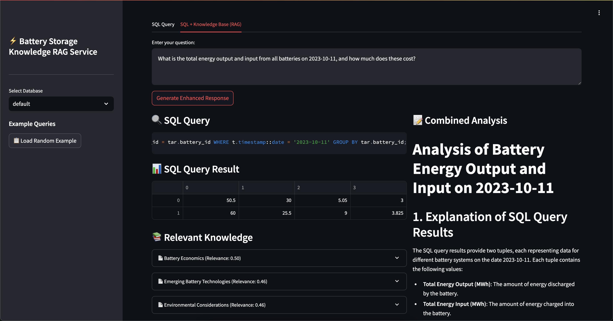

# SQL-Based RAG Service

## Overview

A powerful SQL-based Retrieval Augmented Generation (RAG) service that bridges natural language and database queries. This service enables users to interact with databases using natural language, automatically generating and executing SQL queries while providing clear explanations of the results. 

With the new RAG capability, the service enhances query responses by querying not only structured databases but also external knowledge bases in unstructured formats. It incorporates a vectorized similarity check powered by FAISS to retrieve the most relevant documents from external resources. The service supports both pure natural language to SQL queries and natural language queries that leverage RAG, providing more in-depth analysis and enriched results.

## Demo

Here's a quick walkthrough of how the service works:




1. **Natural Language Input**: Users can ask questions in plain English about their battery storage system. In this example, we ask "List all locations with their battery counts"

2. **Generated SQL Query**: 
    The service automatically generates the appropriate SQL query:
    ```sql
    SELECT l.name AS location_name, COUNT(b.id) AS battery_count 
    FROM locations l
    LEFT JOIN batteries b ON l.id = b.location_id
    GROUP BY l.id
    ORDER BY l.name;
    ```

3. **Query Results**:
    The results are displayed in a clear tabular format:
    | Location | Battery Count |
    |----------|--------------|
    | Site 1   | 2            |
    | Site 2   | 1            |

4. **Intelligent Analysis**:
    The service provides a detailed explanation of:
    - How the SQL query addresses the question
    - The query construction process:
      - Selecting location names and counting batteries
      - Using LEFT JOIN to include all locations
      - Grouping results by location ID
    - Clear interpretation of the results

## Features & Capabilities

- Receives natural language queries.
- Converts them to SQL queries using LangChain and a Llama model.
- Executes the SQL query against one or more PostgreSQL databases (using SQLAlchemy).
- Uses Llama to explain how the query was generated and what the result indicates.
- Exposes the functionality via a FastAPI API (with auto-generated Swagger documentation).
- Includes a simple Streamlit frontend for user interaction.
- Supports both OpenAI and local Llama models.
- Provides detailed explanations of query results.
- Handles complex database relationships and queries.
- Built with scalability and extensibility in mind.
- **New RAG Service**: Enhances query responses by allowing queries not only from structured databases but also from external knowledge bases in unstructured databases.
- **Vectorized Similarity Check**: Powered by FAISS to pull the most relevant documents from external resources.
- Supports both pure natural language to SQL and natural language to query plus RAG from external resources, enhancing query results and providing more in-depth analysis.

## Prerequisites

- Docker and Docker Compose
- Python 3.9 or higher (for local development)
- PostgreSQL 13 or higher
- 8GB+ RAM (16GB+ recommended for local LLama model)
- NVIDIA GPU (optional, for local LLama model)

## Environment Setup

1. Clone the repository:
```bash
git clone https://github.com/yourusername/sql-based-rag.git
cd sql-based-rag
```

2. Create a .env file in the root directory:
```env
# LLM Configuration
LLM_PROVIDER=openai  # or local
OPENAI_API_KEY=your-key-here  # Required if using OpenAI

# Database Configuration
POSTGRES_USER=postgres
POSTGRES_PASSWORD=postgres
POSTGRES_DB=mydatabase

# MongoDB Configuration
MONGO_USER=mongo_user
MONGO_PASSWORD=mongo_password
MONGO_DB=mongo_db
MONGO_HOST=mongo_host
MONGO_PORT=10000
MONGO_URI=mongodb://${MONGO_USER}:${MONGO_PASSWORD}@${MONGO_HOST}:${MONGO_PORT}/${MONGO_DB}?authSource=admin
```

## Project Structure
```
sql-based-rag/
├── backend/                 # Backend service
│   ├── database/           # Database related code
│   │   ├── sql/           # SQL database related code
│   │   │   ├── mock/      # Mock data generation for SQL
│   │   │   └── model/     # SQL database models
│   │   └── nosql/         # NoSQL database related code
│   │       ├── mock/      # Mock data generation for NoSQL
│   │       └── model/     # NoSQL database models
│   ├── Dockerfile          # Backend container definition
│   └── main.py             # FastAPI application
├── frontend/                # Streamlit frontend
├── models/                  # Local LLama model storage
└── docker-compose.yml       # Service orchestration
```

## Scripts

- `start.sh`: Starts all services using Docker Compose
- `end.sh`: Stops all services and cleans up containers
- `reset_db.sh`: Resets the database with fresh mock data
- `cleanup_db.sh`: Cleans up existing database tables
- `download_model.sh`: Downloads the LLama model (for local LLM)
- `reset_nosql_db.sh`: Resets the NoSQL database (MongoDB)
- `reset_sql_db.sh`: Resets the SQL database (PostgreSQL)

## Running Locally

1. Start the services:
```bash
./start.sh
```

2. Reset the database with mock data:
```bash
./reset_nosql_db.sh
./reset_sql_db.sh
```

3. Access the services:
- Frontend: http://localhost:8501
- API Documentation: http://localhost:8000/docs

## LLM Options

### 1. OpenAI (Default)
- Requires an OpenAI API key
- Set in .env: `LLM_PROVIDER=openai`
- Better accuracy but requires API costs

### 2. Local LLama
- Runs completely locally
- Set in .env: `LLM_PROVIDER=local`
- Requires more RAM and benefits from GPU
- Download model: `./download_model.sh`

To switch between providers:
1. Update LLM_PROVIDER in .env
2. Restart services: `./end.sh && ./start.sh`

## API Usage

Normal SQL query endpoint:

```python
import requests

response = requests.post(
    "http://localhost:8000/query",
    json={
        "question": "How many batteries are in each location?",
        "target_db": "default"
    }
)

print(response.json())
```

The enhanced RAG query endpoint is:

```bash
curl -X POST "http://localhost:8000/rag_query" -H "Content-Type: application/json" -d '{
    "question": "Show me all batteries with their current charge levels with their full capacity",
    "target_db": "default"
}' | jq '.'
```

## Roadmap

1. Query Generation Improvements
   - [x] Enhanced accuracy in SQL generation
   - [x] Better handling of complex queries
   - [x] Support for more SQL operations

2. Multi-Database Support
   - [x] Connection to multiple databases
   - Cross-database queries
   - Dynamic database switching

3. Cloud Deployment
   - AWS deployment templates
   - Azure and GCP support
   - Kubernetes configurations

4. Language Support
   - Python package
   - Node.js package
   - Support for other backend languages
   - Language-specific SDKs

## Contributing

Contributions are welcome! Please feel free to submit a Pull Request.

## License

This project is licensed under the MIT License - see the LICENSE file for details. 